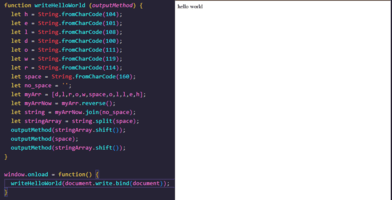

---
## Greetings all, I'm Myles! 

---

#### Languages I know;

  
  
  
  

#### Tools I use;

#### Things I want to learn;

  
  
  
  

---

#### Get in touch;

---

#### Little more about me;

- :cat: I have two cats :cat:
- :fork_and_knife: I love food :fork_and_knife:
- :game_die: I am a game fiend :video_game:
- :musical_note: I know how to play music :notes:

---

### Now Playing 🎧

---

Icons by <a href="https://icons8.com/">icons8</a>

 Some Coding icons created by <a href="https://www.flaticon.com/free-icons/coding" title="coding icons">Freepik - Flaticon</a>

